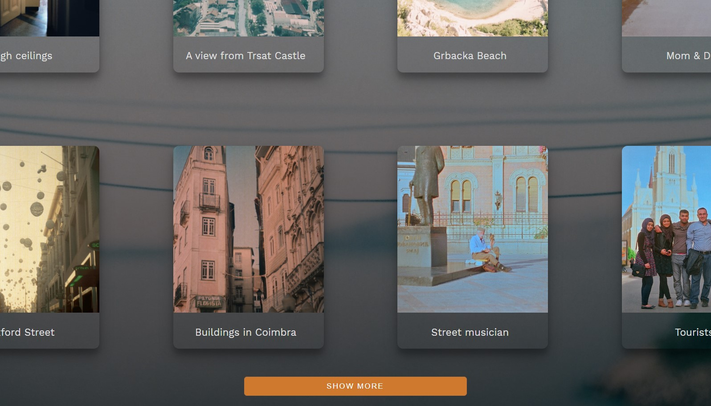
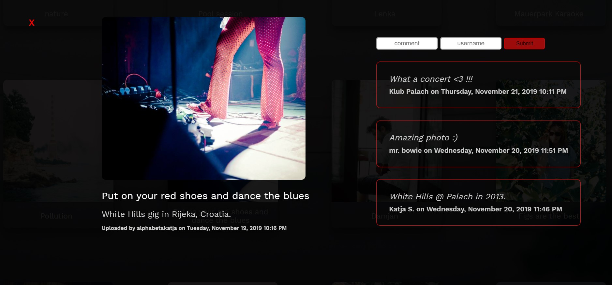

# My Analogue Diary Image Board

## Overview

This is Instagram inspired image board where anybody can upload an analogue picture of their choice and see pictures that others have uploaded.

## Features

This application doesn't require registration, but users can add an image along with the title, description and username

There is a predefined number of pictures shown, more on users request ('see more' button)

Click on a picture opens a modal where anybody can leave a comment

## Technologies

-   HTML
-   CSS
-   Vue.js
-   Node.js/Express.js
-   PostgreSQL
-   AWS S3

## Preview

## Preview

Image board

See more button

Comments

## Roadmap

Work on additional features like giving users the chance to upload pictures directly from internet, adding 'like' option, use IMDb API to enable extensive movie insight.
