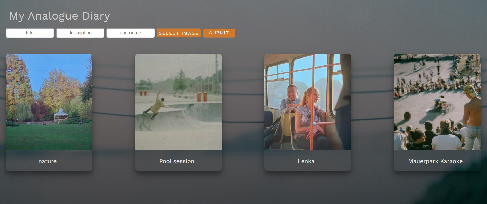

# My Analogue Diary Image Board

I've been taking analogue photos for a long time now and I was never really sure what to do with them.
This project is very dear to me because, except from learning Vue.js, I managed to find a special place to store most of my photos.

## Overview

This is Instagram inspired image board where anybody can upload an analogue picture of their choice and see pictures that others have uploaded.

## Features

This application doesn't require registration, but users can add an image along with the title, description and username

There is a predefined number of pictures shown, more on users request ('see more' button)

Click on a picture opens a modal where anybody can leave a comment

## Technologies

-   HTML
-   CSS
-   Vue.js
-   Node.js/Express.js
-   PostgreSQL
-   AWS S3

## Preview

### Image board

See more button

### Comments

## Roadmap

Work on additional features like giving users the chance to delete their image, 'like' another users image, etc...
